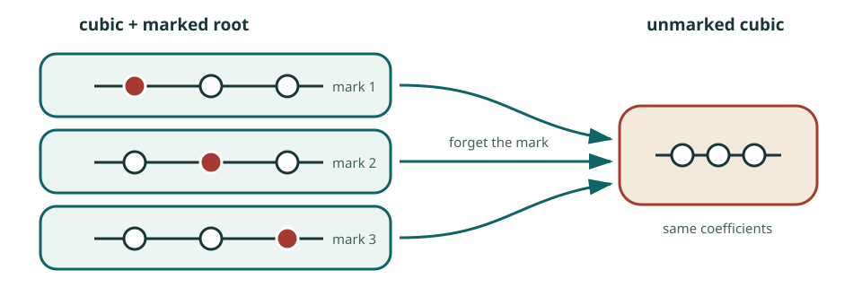

# How the counterexample works: mark a root, then forget it

Suppose one wants a polynomial map that is locally invertible everywhere and
still has several global sheets. The ingredients should provide several
discrete choices over a typical target point, with each individual choice
moving uniquely under a small perturbation.

The roots of a polynomial do exactly that.

## The toy model

Take

\[
g(t)=(t-1)(t-2)(t-3).
\]

The three marked objects

\[
(g,1),\qquad(g,2),\qquad(g,3)
\]

are distinct, although forgetting the second entry sends all three to the
same polynomial \(g\). Near each of the three simple roots, the equation
\(g(t)=0\) can be solved uniquely as the coefficients vary. The derivative
\(g'(t)\) is nonzero there, so the implicit-function theorem follows the
chosen root without ambiguity.

When two roots coalesce, this local uniqueness fails at the repeated root.
The counterexample keeps the simple-root part and arranges for every repeated
marked root to lie outside the affine source.

**Pause and check.** Replace \(g\) by \((t-1)^2(t-3)\). Which marked root
ceases to move uniquely, and where does the derivative vanish?

## The marked-root incidence space

Consider the binary cubic

\[
f(S,T)=cT^3-2ST^2+bS^2T-2aS^3.
\]

The coefficients \((a,b,c)\) form an affine three-dimensional space. Enlarge
the data by choosing a projective root \([S:T]\in\mathbf P^1\). The resulting
incidence variety consists of pairs

\[
(\text{cubic},\text{marked root}).
\]

For a cubic with three distinct roots, the fiber has three points. Removing
the repeated marked roots gives the simple-root open
\(I_{\mathrm{simp}}\), and the forgetful map is étale there.

<figure class="math-figure">
  
  <figcaption>The finite cover remembers all marked roots. The affine source keeps the simple ones.</figcaption>
</figure>

The local and global parts of the construction now have separate sources:

- simplicity of the marked root gives an invertible derivative;
- the three possible marks give a generic three-point fiber.

This is the conceptual core of the example.

## Where the real construction happens

Marking a root readily produces a finite cover. The difficult part is
making its unramified locus into affine space. For a typical incidence
variety, removing the ramification divisor leaves a complicated open
variety rather than \(\mathbf A^3\).

The successful construction fixes the coefficient of \(ST^2\) at \(-2\),
uses a specially chosen tangent hyperplane, and removes the repeated-root
divisor. In that chart the simple-root open becomes affine three-space:

\[
I_{\mathrm{simp}}\simeq\mathbf A^3_{x,y,z}.
\]

Writing this isomorphism in coordinates gives the displayed counterexample.
If \(u=1+xy\), the marked root is

\[
[S:T]=[x:u],
\]

and its image \((P,Q,R)\) satisfies

\[
RT^3-2ST^2+QS^2T-2PS^3=0
\]

at \((S,T)=(x,u)\).

**Where the surprise lies.** The three-sheeted cover comes almost for free
once a root is marked. The tangent chart is the ingenious step: it makes the
simple-root locus affine three-space, after which the determinant computation
becomes short.

## What happens near the discriminant

The discriminant in coefficient space parametrizes cubics with a repeated
root. In the finite marked-root cover, repeated marked roots are ramification
points. They were removed from \(I_{\mathrm{simp}}\), so a family of source
points can approach one of them only by leaving the affine chart.

From the affine viewpoint, the corresponding sheet escapes to infinity. From
the finite-cover viewpoint, the sheet approaches an ordinary boundary point
where ramification occurs. These are two descriptions of the same limiting
behavior.

The construction has now separated the two mysteries. Simple roots explain
the invertible derivative; the deleted repeated-root locus explains how a
sheet can be lost. The next task is to describe that boundary without relying
on the special binary-cubic coordinates.

Continue with [discriminants](../ideas/discriminants.md),
[normalization](../ideas/normalization.md), or
[local versus global invertibility](../ideas/local-and-global.md).

## Sources

- [Unbylined Ulam technical note](https://www.ulam.ai/research/jacobian.pdf)
- [Terence Tao, original geometric digestion](https://terrytao.wordpress.com/2026/07/21/a-digestion-of-the-jacobian-conjecture-counterexample/)
- [David Speyer, Secret Blogging Seminar discussion](https://sbseminar.wordpress.com/2026/07/20/the-new-counterexample-to-the-jacobian-conjecture/)
