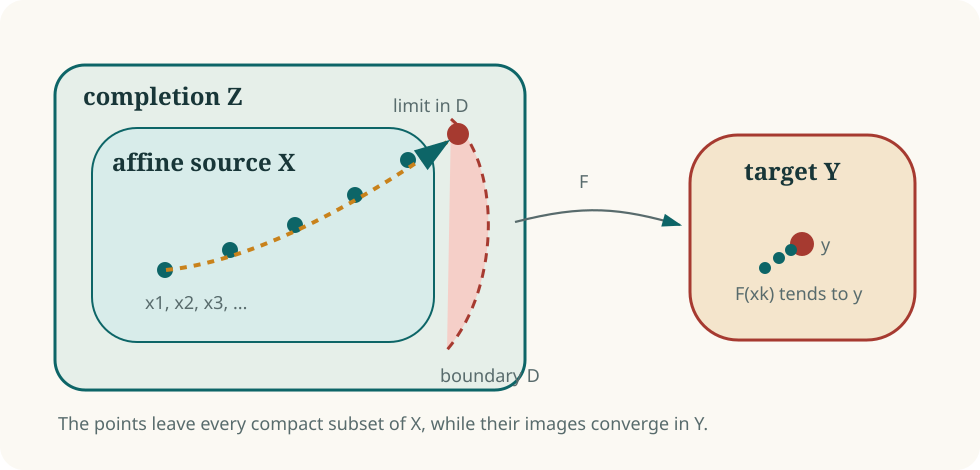

# The plane case: what survived

The Jacobian conjecture for

\[
F=(P,Q)\colon\mathbf C^2\longrightarrow\mathbf C^2
\]

remains open. The three-dimensional counterexample identifies the loophole in
the classical argument: sheets can escape through infinity. Producing that
behavior in the plane requires a different construction.

## Why the third coordinate cannot simply be removed

A first attempt is to restrict the known map to a plane in its source. Three
separate difficulties appear.

1. A source plane usually maps to a curved surface, so the restriction is
   not a polynomial self-map of a target plane.
2. Even for compatible source and target slices, the determinant of the
   restricted derivative is a minor of the full Jacobian matrix, and that
   minor need not be constant.
3. Eliminating the third variable generally produces a rational relation
   rather than a polynomial self-map of \(\mathbf A^2\).

The third variable is part of the marked-root chart that makes the source
\(\mathbf A^3\). Removing it destroys the chart on which the polynomial
construction depends.

## What a plane counterexample would have to do

A plane Keller map is étale at every finite point. If it were noninvertible,
it would have to be nonproper: some sequence \(x_k\in\mathbf C^2\) would
escape to infinity while \(F(x_k)\) remained bounded.

<figure class="math-figure">
  
  <figcaption>A hypothetical plane counterexample must lose sheets through the boundary; no finite critical point is available.</figcaption>
</figure>

Compactifying the source turns that escape into geometry of boundary curves.
Their valuations, intersections, Puiseux expansions, and Newton polygons are
highly constrained. Much of the plane literature can be read as an attempt
to show that no boundary configuration satisfies all of those constraints at
once.

## The current degree frontier

A published 2022 reduction of Guccione, Guccione, Horruitiner, and Valqui
excludes every maximum coordinate degree below \(125\) except the pair
\((72,108)\), up to order, and reduces that pair to two explicit support
configurations.

On 23 July 2026, the MathOverflow user **ratto3423** announced a
computer-assisted calculation eliminating those final supports. The announced
conclusion is

\[
\max\{\deg P,\deg Q\}\ge125
\]

for any characteristic-zero plane counterexample. Degree \(125\) itself
remains possible. The [proof and evidence
ledger](../results/evidence-ledger.md#the-announced-plane-degree-bound-125)
separates the published reduction from the announced terminal calculation.

[Read the degree-bound essay](../results/below-125.md){ .md-button .md-button--primary }
[See the proof and evidence record](../results/evidence-ledger.md#the-announced-plane-degree-bound-125){ .md-button }

## The question now

The surviving problem has a sharper geometric form:

> Can an étale polynomial self-map of the affine plane lose sheets at infinity?

A positive answer requires a boundary configuration that survives every
local and global compatibility equation. A negative answer requires an
invariant strong enough to rule out such configurations in every degree.

That is why the plane problem now belongs naturally to the study of
compactifications, valuations, Newton--Puiseux expansions, and dessins.
