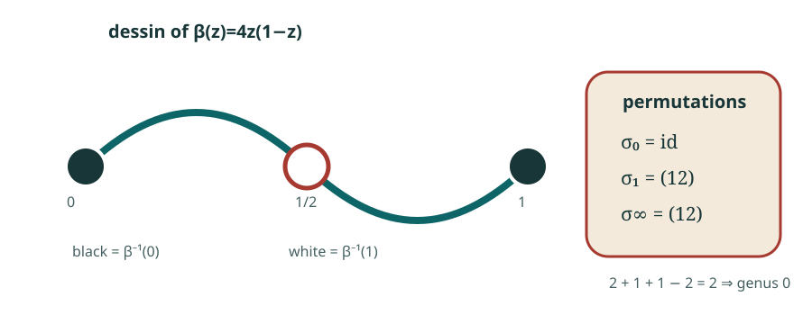

# Dessins d'enfants: turning a branched cover into a graph

A **Belyi map** is a finite map

\[
\beta\colon X\longrightarrow\mathbf P^1
\]

from a compact algebraic curve that branches only over
\(0\), \(1\), and \(\infty\). The inverse image of the interval \([0,1]\)
is a bipartite graph embedded in \(X\): black vertices lie over \(0\), white
vertices lie over \(1\), and the complementary faces contain the points over
\(\infty\).

This graph is a **dessin d'enfant**. It converts an analytic branched cover
into finite combinatorial data without forgetting the topology of the
surface.

## Worked example: a degree-two Belyi map

Take

\[
\beta(z)=4z(1-z)
\]

on the Riemann sphere. Its zeros are \(0\) and \(1\), its unique finite
critical point is \(z=1/2\), and

\[
\beta(1/2)=1.
\]

The only branch values are therefore \(1\) and \(\infty\), a subset of
\(\{0,1,\infty\}\). The dessin has two black vertices, one white vertex, and
two edges.

Label the two sheets. Small loops around \(0\), \(1\), and \(\infty\) give
permutations

\[
\sigma_0=\mathrm{id},
\qquad
\sigma_1=(12),
\qquad
\sigma_\infty=(12),
\]

with

\[
\sigma_0\sigma_1\sigma_\infty=1.
\]

The two fixed points of \(\sigma_0\) are the two black vertices. The single
2-cycle of \(\sigma_1\) is the white vertex of valency two. The single
2-cycle of \(\sigma_\infty\) is the unique face.

## Recovering the genus from permutations

Let \(c(\sigma)\) denote the number of cycles of a permutation, including
fixed points. For a transitive degree-\(d\) dessin,

\[
2-2g
=
 c(\sigma_0)+c(\sigma_1)+c(\sigma_\infty)-d.
\]

In the example,

\[
2+1+1-2=2,
\]

so \(g=0\), as expected for the sphere.

A **passport** records the three cycle types. Fixing a passport turns the
classification of possible covers into a finite permutation problem: find
transitive triples with the prescribed cycle types and product one, modulo
simultaneous conjugation.

## Why dessins arise in the plane Jacobian problem

On a Newton face of a hypothetical plane Keller map, the constant-Jacobian
equation can force a rational function whose derivative has zeros and poles
in exactly three fibres. After normalizing those fibres to
\(0,1,\infty\), the function is a Belyi map.

The allowed leading face is then constrained by a passport. One can enumerate
the corresponding dessins before reconstructing exact coefficients. In the
degree-21 boundary calculation, the forced passport has exactly five
connected dessins. They form one arithmetic orbit and have monodromy
\(A_{21}\).

## What a dessin does not prove

A dessin controls a branched cover associated with one boundary layer. It
does not guarantee that:

- the layer extends through every later Newton--Puiseux equation;
- the local data glue across all boundary charts;
- the resulting object is a global polynomial Keller pair.

The distinction between classifying the face and excluding the full support
is essential in the below-125 story.

[Read the degree-21 result](../results/degree-21-dessins.md){ .md-button }

## Where to read next

| Level | Recommendation | Use it for |
| --- | --- | --- |
| Concrete graduate introduction | [Lando and Zvonkin, *Graphs on Surfaces and Their Applications*](https://doi.org/10.1007/978-3-540-38361-1) | Coverings, maps on surfaces, permutation triples, and many examples. |
| Arithmetic viewpoint | Leila Schneps, ed., *The Grothendieck Theory of Dessins d'Enfants* | Galois actions and the arithmetic significance of dessins. |
| Covering-space background | [Allen Hatcher, *Algebraic Topology*, §1.3](https://pi.math.cornell.edu/~hatcher/AT/AT.pdf) | Monodromy and lifting before ramification is introduced. |
| This boundary problem | [Guccione--Guccione--Horruitiner--Valqui, arXiv:2204.14178](https://arxiv.org/abs/2204.14178) | The Newton-face setting from which the degree-21 passport arises. |
