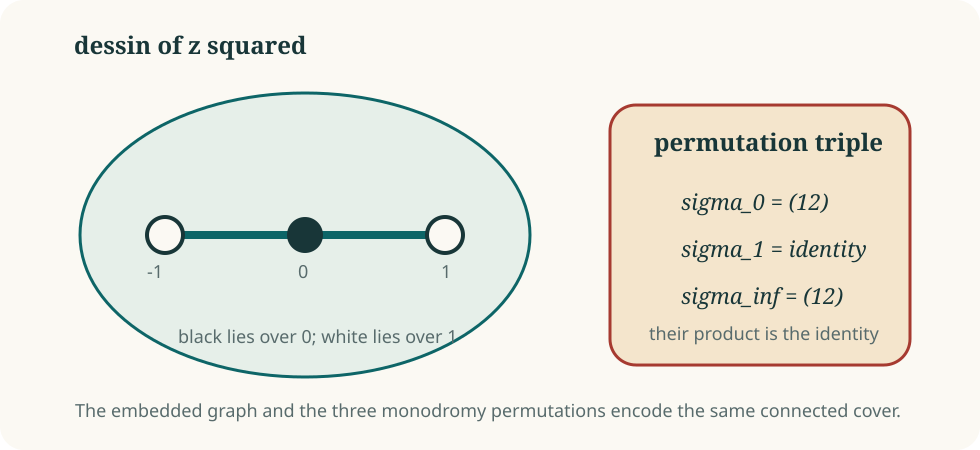

# Dessins d'enfants: from boundary equations to permutations

A **Belyi map** is a map from an algebraic curve to the projective line whose
branch values lie in \(\{0,1,\infty\}\). The inverse image of the interval
\([0,1]\) is a bipartite graph embedded in the curve, called a *dessin
d'enfant*.

The striking feature is compression. A branched cover described by equations
can be encoded by a finite graph—or equivalently by three permutations.

## The smallest example

For \(z\mapsto z^2\), the only branch values are \(0\) and \(\infty\). The
preimage of \([0,1]\) is the interval from \(-1\) to \(1\), with a black
vertex over \(0\) and white vertices over \(1\):

<figure class="math-figure">
  
  <figcaption>The graph and the permutation triple encode the same degree-two cover.</figcaption>
</figure>

For a degree-\(d\) Belyi map, loops around \(0\), \(1\), and \(\infty\) give
permutations

\[
\sigma_0,\qquad\sigma_1,\qquad\sigma_\infty
\]

of the \(d\) sheets, with

\[
\sigma_0\sigma_1\sigma_\infty=1.
\]

Their cycle lengths record the ramification. Transitivity records
connectedness. The three cycle partitions form the **passport** of the
dessin.

## Why Belyi maps appear at infinity

On a Newton face of a hypothetical plane Keller map, the constant-Jacobian
equation can reduce to a differential identity for two one-variable
polynomials. Repackaging that identity produces a rational function whose
critical values lie over \(0\), \(1\), and \(\infty\). The boundary problem
has become a Belyi problem.

The passport is often restrictive enough to enumerate every connected
permutation triple. This produces a finite list of dessins from which the
exact coefficients can be reconstructed.

## The degree-21 compression

For the two Newton supports remaining below degree \(125\), the forced
leading-face equation produces a degree-21 Belyi map with passport

\[
(2^{10}1),\qquad(3^7),\qquad(17\,1^4).
\]

There are exactly five connected dessins with this passport. They form one
arithmetic orbit and have monodromy group \(A_{21}\).

This is a remarkable reduction: an infinite-looking boundary coefficient
problem collapses to five exact combinatorial models.

## The remaining globalization problem

A dessin determines one boundary layer. To obtain a global polynomial Keller
pair, every later Puiseux layer must exist and satisfy the Jacobian equations.
The route from a global candidate to the chosen Newton face must also be
complete.

Thus the five dessins are exact candidate boundary models. They become a
degree exclusion only after the later compatibility equations eliminate all
five in every globally admissible support.

[Read the degree-21 classification](../results/degree-21-dessins.md){ .md-button .md-button--primary }

## Sources

- [Guccione–Guccione–Horruitiner–Valqui, arXiv:2204.14178](https://arxiv.org/abs/2204.14178)
- [Proof and evidence record for the degree-21 classification](../results/evidence-ledger.md#five-degree-21-dessins)
