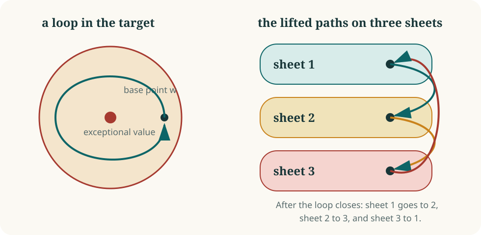

# Covers and monodromy: how the sheets move

Away from exceptional target values, a generically finite polynomial map has
a fixed number \(d\) of preimages. This is its **generic degree**. For the
marked-cubic counterexample, \(d=3\): the three source points correspond to
the three possible marked roots.

Generic degree counts the sheets. Monodromy records how continuation along
loops connects them.

## Follow one root around a loop

For the map \(z\mapsto z^d\), choose a nonzero target \(w\) and label its
\(d\) roots. Move \(w\) once around the origin. Each root moves continuously,
and when the loop closes it has arrived at the next root.

<figure class="math-figure">
  
  <figcaption>Continuation around a loop returns to the same target point and may permute its preimages.</figcaption>
</figure>

The permutations obtained from all such loops form the **monodromy group**.
For a connected cover the action on the sheets is transitive: every sheet can
be reached from every other by continuation.

**Pause and check.** For \(z\mapsto z^3\), start with the positive real cube
root of \(w\). After one counterclockwise turn of \(w\), which cube root do
you reach?

## What the permutation group reveals

Suppose a map factors as

\[
F=G\circ H.
\]

A point in a generic fiber of \(F\) is chosen in two stages: first a preimage
under \(G\), then a preimage under \(H\). The sheets therefore come in blocks,
and monodromy must preserve that block system.

A primitive monodromy group has no nontrivial block system. Primitivity is
therefore a strong obstruction to decomposing the generic cover. For prime
generic degree, transitivity already forces primitivity.

This is one reason the degree-three example is structurally clean: a
transitive action on three sheets has very little room to decompose.

## The affine chart adds another layer

Monodromy belongs to the generic finite cover. Two polynomial maps can have
the same function-field extension and the same monodromy while using
different affine opens inside the finite completion. Their deleted
boundaries may have different geometry, and affineness can hold for one
opening and fail for another.

Monodromy answers one precise question: how continuation glues the generic
sheets. Discriminants, normalization, and boundary data then recover the
geometry that the permutation action leaves out.

[Next: discriminants and root collisions](discriminants.md){ .md-button .md-button--primary }

## Sources

- [David Speyer, Secret Blogging Seminar discussion](https://sbseminar.wordpress.com/2026/07/20/the-new-counterexample-to-the-jacobian-conjecture/)
- [Shuhong Gao, arXiv:2608.00222](https://arxiv.org/abs/2608.00222)
