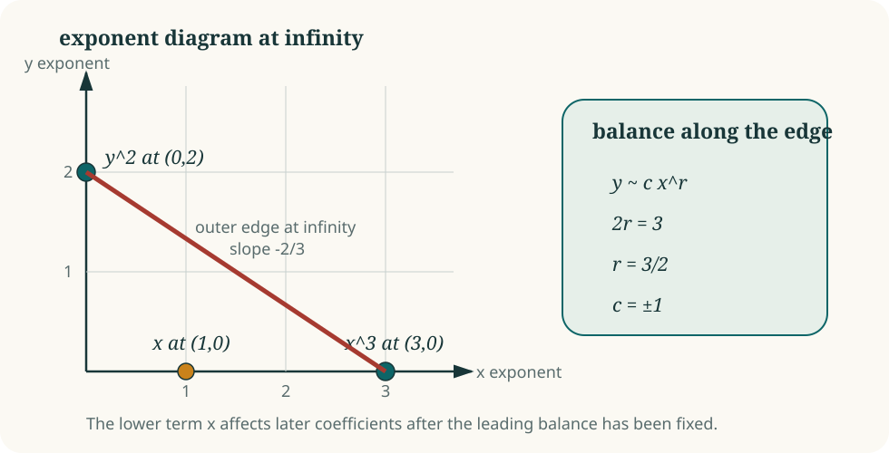

# Newton--Puiseux expansions: a microscope for infinity

Suppose a plane curve is defined by a polynomial equation. Near infinity, a
branch can often be written as a fractional power series

\[
y=c_0x^{r_0}+c_1x^{r_1}+c_2x^{r_2}+\cdots,
\]

with rational exponents. The Newton polygon predicts the first exponent and
coefficient. Substitution reveals the next term, and the process repeats.

A Puiseux expansion is a microscope for infinity: each new exponent records
the next condition that an escaping branch must satisfy.

## Balance the leading terms

For the toy curve

\[
y^2=x^3+x,
\]

the largest terms at infinity must balance. If \(y\sim cx^r\), then

\[
2r=3,
\qquad
c^2=1.
\]

Thus

\[
y\sim\pm x^{3/2}.
\]

The relevant edge of the Newton polygon joins the exponent points of \(y^2\)
and \(x^3\):

<figure class="math-figure">
  
  <figcaption>The slope of the leading edge determines the first Puiseux exponent; substitution determines later terms.</figcaption>
</figure>

The fractional exponent is the natural coordinate of the branch. Passing to
\(x=t^{-2}\), for example, makes \(y\) an ordinary Laurent series in \(t\).

**Pause and check.** Substitute
\(y=x^{3/2}(1+ax^{-2}+\cdots)\) into \(y^2=x^3+x\). What is the first value of
\(a\)?

## Why the plane Jacobian problem produces Puiseux series

A hypothetical nonproper Keller map of the plane has a branch escaping to
infinity while its image stays bounded. Following that branch turns the
coordinate polynomials \(P\) and \(Q\) into Laurent or Puiseux series. The
identity

\[
\det D(P,Q)=\text{constant}
\]

then becomes a sequence of equations, one order at a time.

The first equations constrain the Newton faces of \(P\) and \(Q\). Later
equations decide whether those faces extend to full series and eventually to
global polynomials. This creates a hierarchy:

\[
\text{Newton support}
\longrightarrow
\text{leading-face equation}
\longrightarrow
\text{successive Puiseux layers}
\longrightarrow
\text{global polynomial pair}.
\]

Every arrow carries additional compatibility conditions.

## Where low-degree exclusions come from

At a fixed degree, only finitely many Newton shapes are possible. Arithmetic
and geometric constraints eliminate most of them before any detailed
coefficient calculation begins. The remaining shapes lead to explicit
systems of equations, sometimes small enough for exact computer algebra.

The current degree-below-125 work follows exactly this hierarchy. The
published paper reduces every candidate to two precise supports. A later
announcement states that a terminal calculation eliminates both. The terminal
equations matter because the global reduction has already shown that every
candidate must reach them.

A leading-face equation can sometimes be compressed further into a finite
classification of permutation triples.

[Next: dessins turn boundary equations into finite data](dessins.md){ .md-button .md-button--primary }

## Sources

- [Guccione–Guccione–Horruitiner–Valqui, arXiv:2204.14178](https://arxiv.org/abs/2204.14178)
- [ratto3423, MathOverflow announcement](https://mathoverflow.net/a/513493)
