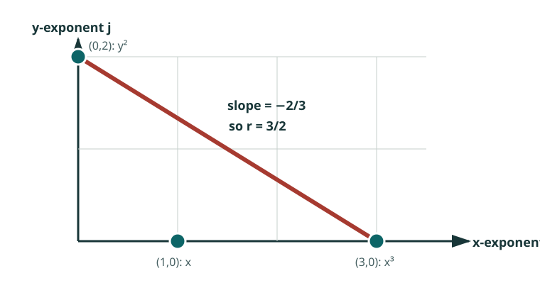

# Newton--Puiseux expansions: reading a curve at infinity

An algebraic curve need not be the graph of an ordinary power series near a
singular point or near infinity. It often becomes one after allowing
fractional powers. A **Puiseux expansion** has the form

\[
y=c_0x^{r_0}+c_1x^{r_1}+c_2x^{r_2}+\cdots,
\]

with rational exponents. The Newton polygon predicts the first exponent and
coefficient; substitution then reveals the next layer.

## Worked example: \(y^2=x^3+x\)

Consider

\[
f(x,y)=y^2-x^3-x=0
\]

for large \(x\). Suppose first that \(y\sim c x^r\). The dominant powers must
cancel. The terms \(y^2\) and \(x^3\) have orders \(2r\) and \(3\), so

\[
2r=3,
\qquad c^2=1.
\]

Thus there are two branches beginning

\[
y\sim \pm x^{3/2}.
\]

The exponent \(3/2\) is read from the compact edge of the Newton polygon of
\(f\), joining the exponent vectors \((0,2)\) and \((3,0)\).

Here the full expansion can be obtained directly:

\[
y=\pm x^{3/2}\sqrt{1+x^{-2}}.
\]

Using

\[
(1+u)^{1/2}=1+\frac12u-\frac18u^2+\cdots
\]

gives

\[
\boxed{
y=\pm\left(x^{3/2}+\frac12x^{-1/2}-\frac18x^{-5/2}+\cdots\right).
}
\]

The fractional exponent is not a defect in the method. It is the natural
local coordinate of the branch. Writing \(x=t^{-2}\) turns the same branch
into an ordinary Laurent series in \(t\).

## The Newton--Puiseux step

For a general polynomial

\[
f(x,y)=\sum a_{ij}x^iy^j,
\]

plot the exponent vectors \((i,j)\). An edge of the Newton polygon selects a
set of terms that can have the same order after substituting \(y=cx^r\). The
edge slope determines \(r\); the coefficients on the edge give an **initial
equation** for \(c\).

After choosing a root \(c_0\), substitute

\[
y=c_0x^{r_0}+y_1
\]

and repeat. Under suitable hypotheses, the process produces all local
branches. Over characteristic zero, the Newton--Puiseux theorem says that
after adjoining a finite root of the local parameter, algebraic plane-curve
branches admit convergent Puiseux expansions.

## Why it appears in the plane Jacobian problem

A hypothetical nonproper Keller map of the plane must have source points
escaping to infinity while their images remain bounded. Following such a
branch turns the coordinate polynomials \(P\) and \(Q\) into Laurent or
Puiseux series. The identity

\[
\frac{\partial(P,Q)}{\partial(x,y)}=\text{constant}
\]

then imposes equations order by order.

The first balances are combinatorial: they constrain Newton polygons and
leading faces. Later balances are algebraic: they constrain coefficients,
residues, and possible ramification. A large global problem can thereby be
reduced to a finite list of support shapes and, eventually, to finite exact
systems.

## The logical caution

A formal branch is necessary data, not a global map.

- Solving one initial equation does not show that every later coefficient can
  be chosen.
- A compatible formal series need not come from a global polynomial pair.
- A contradiction in a terminal system excludes a global candidate only
  after a proved reduction routes every candidate to that system.

This distinction is central to the announced degree-below-125 result. The
published work supplies the global reduction to two precise supports; a later
MathOverflow answer announces a terminal computation closing them. A
calculation on an unattached formal branch would not prove the global degree
bound.

## Where to read next

| Level | Recommendation | Use it for |
| --- | --- | --- |
| Focused first chapter | [Eduardo Casas-Alvero, “Newton--Puiseux algorithm”](https://doi.org/10.1017/CBO9780511569326.003) | A systematic algorithm with plane-curve applications. |
| Graduate text | Eduardo Casas-Alvero, *Singularities of Plane Curves* | Branches, intersection multiplicity, valuations, and infinitely near points. |
| Broader plane curves | [Ernst Kunz, *Introduction to Plane Algebraic Curves*](https://link.springer.com/book/10.1007/0-8176-4443-1) | Algebraic foundations and examples with relatively modest prerequisites. |
| This problem | [Guccione--Guccione--Horruitiner--Valqui, arXiv:2204.14178](https://arxiv.org/abs/2204.14178) | The Newton-polygon reduction used in the current plane degree bound. |

[Next: dessins make some boundary data finite](dessins.md){ .md-button }
