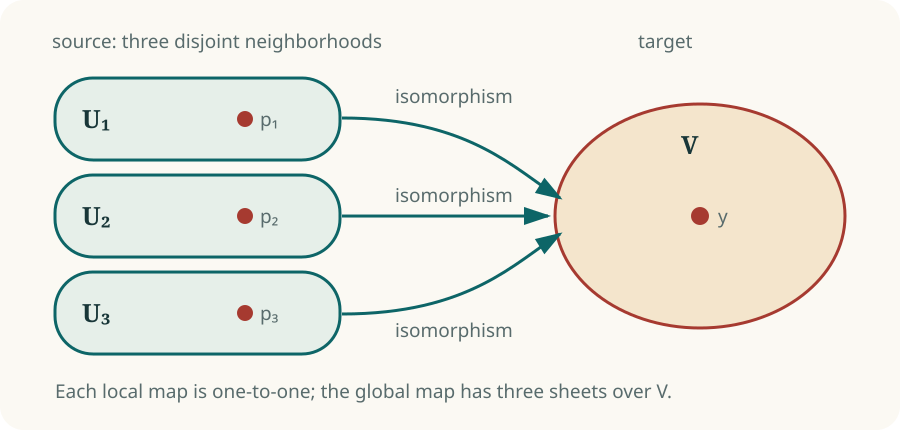

# The Jacobian conjecture

Let

\[
F=(F_1,\ldots,F_n)\colon \mathbf C^n\longrightarrow\mathbf C^n
\]

be a polynomial map. Its Jacobian matrix \(DF(p)\) is the best linear
approximation to \(F\) near a point \(p\). When \(\det DF(p)\ne0\), the
inverse-function theorem gives neighborhoods

\[
p\in U,\qquad F(p)\in V,
\]

on which \(F\colon U\to V\) is an analytic isomorphism.

The classical conjecture promoted this local statement to a global one:

> **Classical Jacobian conjecture.** If \(\det DF\) is a nonzero constant,
> then \(F\) is a polynomial automorphism.

Over \(\mathbf C\), a polynomial with no zeros is constant, so “the Jacobian
determinant never vanishes” is equivalent to the hypothesis above.

## What the derivative can see

An invertible derivative rules out folding, ramification, and infinitesimal
collapse at every finite point. It says nothing directly about two distant
source points. Distinct neighborhoods may each map isomorphically onto the
same target neighborhood:

<figure class="math-figure">
  
  <figcaption>Each sheet is locally perfect. The collision is a relation among different sheets.</figcaption>
</figure>

In one variable, the condition forces \(F'\) to be constant, hence \(F\) is
linear. In higher dimensions, many important special classes are also known
to be invertible. The conjecture remained plausible because every finite
local test pointed in the right direction.

## The missing global condition

Properness closes the gap. A map is proper when inverse images of compact
sets are compact. A proper local homeomorphism is a covering map; since
\(\mathbf C^n\) is simply connected, a connected covering of
\(\mathbf C^n\) has one sheet. In the algebraic setting, the resulting
finite étale map of degree one is an isomorphism.

A noninvertible Keller map must therefore fail properness. There must be a
sequence \(x_k\) escaping to infinity while \(F(x_k)\) remains bounded. After
compactifying the source and passing to a subsequence, the escaping points
approach the boundary. This is where global noninvertibility becomes visible.

**The picture to keep.** The Jacobian condition controls every finite
microscope view of the map. Properness controls whether pieces of the source
can disappear through infinity.

## What changed in 2026

The explicit three-dimensional example has constant determinant \(-2\) and a
three-point collision. It is locally invertible everywhere, generically
three-to-one, and nonproper. Adding unused coordinates gives counterexamples
in every dimension \(n\ge3\).

The status is now:

- \(n=1\): true;
- \(n=2\): open;
- \(n\ge3\): false.

The plane problem now has its own geometric form: does the geometry of the
affine plane prevent the same escape mechanism?

[See the counterexample](counterexample.md){ .md-button .md-button--primary }
[Continue to the plane case](../background/plane-case.md){ .md-button }

## Sources

- [Ott-Heinrich Keller, “Ganze Cremona-Transformationen” (1939)](https://doi.org/10.1007/BF01695502)
- [Unbylined Ulam technical note on the 2026 counterexample](https://www.ulam.ai/research/jacobian.pdf)
- [Lázaro Orlando Rodríguez Díaz, “On the origin of the Jacobian conjecture” (2026)](https://doi.org/10.5802/crmath.831)
