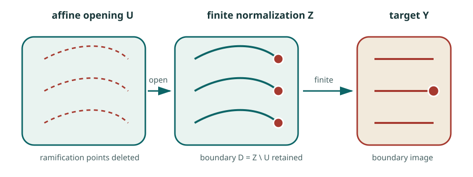

# Three views of the counterexample

The same map can be read in three different ways. Each viewpoint makes one
part of the phenomenon nearly obvious and leaves another part obscure.
Together they give a much better guide than the formula alone.

## I. The polynomial formula

The explicit coordinates are

\[
\begin{aligned}
P&=(1+xy)^3z+y^2(1+xy)(4+3xy),\\
Q&=y+3x(1+xy)^2z+3xy^2(4+3xy),\\
R&=2x-3x^2y-x^3z.
\end{aligned}
\]

The formula gives the shortest exact verification. The identities
\(\det DF=-2\) and the three-point collision already prove the
counterexample.

In expanded coordinates, the determinant identity looks like a large and
unlikely cancellation. The factorization through

\[
(P,y,s),\qquad s=\frac{x}{1+xy},
\]

shows that the cancellation comes from two simple Jacobian factors. The
global sheet structure appears when we recover the hidden marked root.

**Use this viewpoint for exact verification:** the determinant and the
collision are short polynomial identities.

## II. Mark a root, then forget it

Attach to a target point \((P,Q,R)\) the binary cubic

\[
f_{P,Q,R}(S,T)=RT^3-2ST^2+QS^2T-2PS^3.
\]

A source point determines a root \([x:1+xy]\) of this cubic. For a cubic with
three distinct roots, there are three possible choices of mark. Forgetting
which root was chosen is therefore generically three-to-one.

<figure class="math-figure">
  
  <figcaption>A generic cubic has three simple roots. The three possible marks are the three sheets.</figcaption>
</figure>

The local behavior is equally natural. A simple root varies analytically with
the coefficients, by the implicit-function theorem. The forgetful map is
therefore locally invertible wherever the marked root is simple.

This is the central idea of the construction: **many global choices without
local ambiguity**. A root can be followed uniquely near a chosen simple root,
even though a distant observer who sees only the cubic has forgotten which
of its three roots was followed.

The hard step is the affine chart. Marking roots produces a finite cover in a
routine way. The special tangent slice removes every repeated marked root and
turns the remaining space into \(\mathbf A^3\). This is the step that converts
the geometric cover into a polynomial self-map of affine three-space.

**Use this viewpoint for the sheet structure:** it explains generic degree
three and local invertibility in the same picture.

## III. Complete the cover, then inspect the boundary

The counterexample is étale, hence quasi-finite, and it determines a finite
extension of rational function fields. Normalize the target in that
extension. The result is a canonical finite map

\[
Z\longrightarrow \mathbf A^3.
\]

Because the source is normal, Zariski's Main Theorem identifies the original
source \(X=\mathbf A^3\) with an open subset of \(Z\):

<figure class="math-figure">
  
  <figcaption>The finite cover is completed by adding a boundary \(D=Z\setminus X\). In the marked-root model, \(D\) contains the repeated marked roots.</figcaption>
</figure>

Now the escape mechanism has a precise location. Over a generic target value,
all three points of the finite cover lie in \(X\). As the target approaches
the discriminant, some marked roots become repeated. Those points remain in
\(Z\) as ramification points of the finite cover. They belong to the deleted
boundary \(D\), so the affine source has no limiting point. From the viewpoint
of \(X\), a sheet has run off to infinity.

The affine Jacobian stays nonzero because every ramification point involved
in this degeneration lies on the boundary added by the finite completion.

The boundary viewpoint is also the most useful one for later questions. It
makes discriminants, conductors, normalization, valuations, and
compactifications intrinsic. It asks which finite cover was present before
coordinates were chosen and which divisor was removed to obtain affine
space.

**Use this viewpoint for intrinsic geometry:** nonproperness becomes a
question about the deleted boundary and the affine complement.

## What to remember

The three viewpoints divide the labor:

| Viewpoint | Best question | Central object |
| --- | --- | --- |
| Formula | Can I check the counterexample exactly? | The displayed polynomials |
| Marked root | Why are there three sheets with no local ramification? | A cubic with one chosen simple root |
| Boundary | Where do exceptional sheets go, and what survives coordinates? | \(X\hookrightarrow Z\to Y\) and \(D=Z\setminus X\) |

The formula proves that the conjecture fails. The marked-root cover makes the
failure intelligible. The boundary picture turns the example into a research
program.

[Work through the marked-root geometry](../background/marked-root-geometry.md){ .md-button .md-button--primary }
[Continue to local versus global invertibility](../ideas/local-and-global.md){ .md-button }
